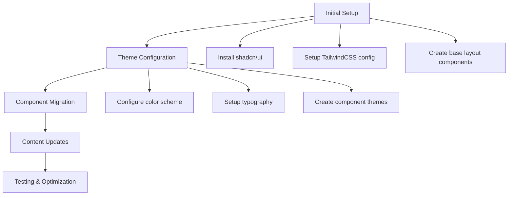

# Portfolio Update Implementation Plan

## Overview
This document outlines the plan for updating the portfolio website to use shadcn/ui components and implement new content changes with a modern blue and gold aesthetic.



## Design System

### Color Palette

The color palette is designed to convey professionalism, trustworthiness, and academic achievement, using blue and gold as the primary colors:

#### Primary Colors
- **Royal Blue (#2563EB)**: Represents professionalism, trust, and reliability
- **Amber Gold (#F59E0B)**: Represents achievement, prestige, and honor societies

#### Secondary Colors
- **Light Blue (#60A5FA)**: Used for hover states and accents in dark mode
- **Light Gold (#FBBF24)**: Used for hover states and accents in dark mode
- **Dark Blue (#1E40AF)**: Used for active states and deeper accents
- **Dark Gold (#B45309)**: Used for active states and deeper accents

    %% Component Migration
    C --> C1[Navigation components]
    C --> C2[Page layouts]
    C --> C3[Interactive elements]
    C --> C4[Forms and inputs]

    %% Content Updates
    D --> D1[Update achievements]
    D --> D2[Revise project listings]
    D --> D3[Add society memberships]

    %% Testing & Optimization
    E --> E1[Responsive testing]
    E --> E2[Performance audit]
    E --> E3[Accessibility checks]
```

## 1. Initial Setup

### Installation & Configuration
1. Install shadcn/ui and its dependencies:
```bash
npx shadcn-ui@latest init
```

2. Configure initial theme settings in `globals.css`:
```css
@layer base {
  :root {
    --background: 0 0% 100%;
    --foreground: 222.2 84% 4.9%;

    --primary: 217 91% 53%;      /* Royal Blue (#2563EB) */
    --primary-foreground: 210 40% 98%;

    --secondary: 35 92% 51%;     /* Amber Gold (#F59E0B) */
    --secondary-foreground: 210 40% 98%;

    /* Additional theme colors... */
  }
}
```

## 2. Component Migration Strategy

### Priority Components
1. **Navigation Components**
   - Navbar with dropdown menus
   - Mobile navigation drawer
   - Footer with social links

2. **Content Components**
   - Hero section
   - Project cards
   - Achievement cards
   - Photo gallery
   - Contact form

3. **Interactive Elements**
   - Buttons
   - Form inputs
   - Tooltips
   - Loading states

### Implementation Order
1. Base layout components (app/layout.tsx)
2. Navigation system
3. Homepage components
4. Project showcase components
5. Contact form
6. Photography gallery
7. About page sections

## 3. Content Structure Updates

### Homepage
1. Hero Section
   - Updated role description
   - Society memberships
   - Call-to-action buttons

2. Featured Projects
   - StatScholar
   - Aevita Nonprofit
   - AJ City Council Campaign

3. Recent Achievements
   - California Cybersecurity Task Force
   - Honor Society memberships
   - Robotics competition initiatives

### Projects Page
1. Project Categories
   - Web Development
   - Data Analytics
   - Educational Technology
   - Nonprofit Initiatives

2. Filtering System
   - Technology-based filters
   - Project type filters
   - Timeline-based sorting

### About Page
1. Professional Timeline
   - Education history
   - Work experience
   - Volunteer work

2. Skills & Expertise
   - Technical skills
   - Software proficiency
   - Professional certifications

## 4. Theme Configuration

### Color Palette
```javascript
const colors = {
  primary: {
    DEFAULT: '#2563EB',  // Royal Blue
    light: '#60A5FA',
    dark: '#1E40AF',
  },
  secondary: {
    DEFAULT: '#F59E0B',  // Amber Gold
    light: '#FCD34D',
    dark: '#D97706',
  },
  accent: {
    DEFAULT: '#6366F1',  // Complementary accent
    light: '#818CF8',
    dark: '#4F46E5',
  },
}
```

### Typography
```javascript
const typography = {
  primary: 'Inter',
  secondary: 'system-ui',
  heading: {
    fontWeight: 600,
    letterSpacing: -0.025,
  },
  body: {
    fontWeight: 400,
    lineHeight: 1.65,
  },
}
```

## 5. Implementation Timeline

1. **Week 1: Foundation**
   - Set up shadcn/ui
   - Configure theme
   - Migrate base layout components

2. **Week 2: Core Components**
   - Implement navigation system
   - Create reusable components
   - Set up content structure

3. **Week 3: Content Migration**
   - Update content across all pages
   - Implement new sections
   - Add interactive elements

4. **Week 4: Polish & Optimization**
   - Responsive testing
   - Performance optimization
   - Accessibility improvements

## 6. Next Steps

1. Review and approve this implementation plan
2. Begin shadcn/ui installation and setup
3. Create initial theme configuration
4. Start component migration process
